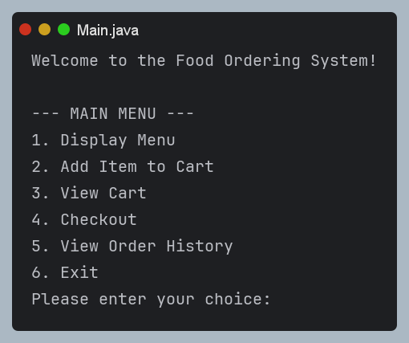
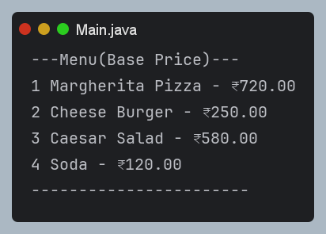
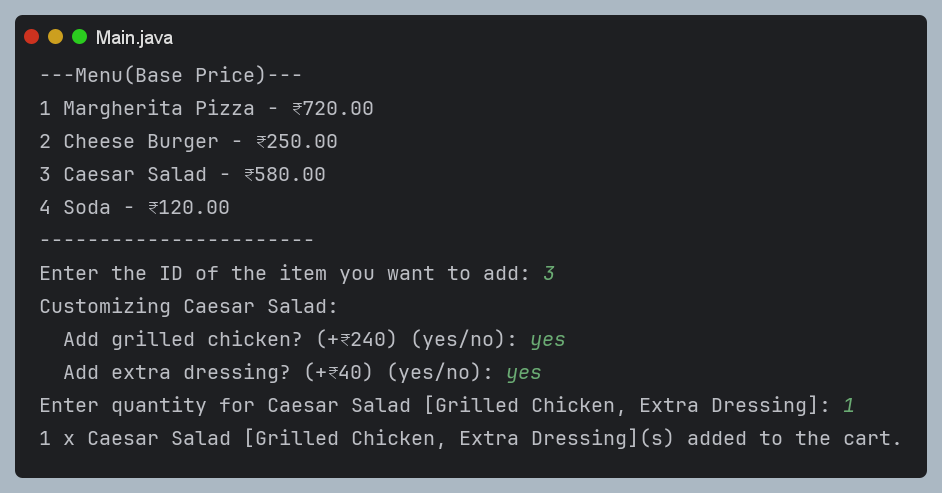
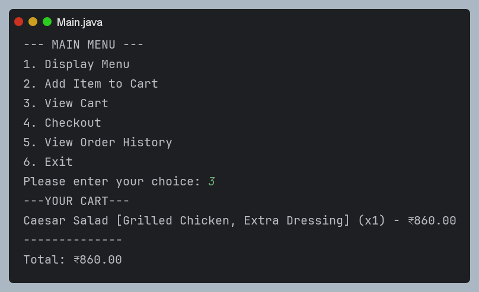
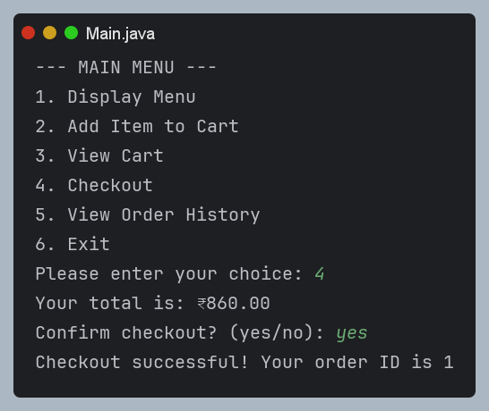
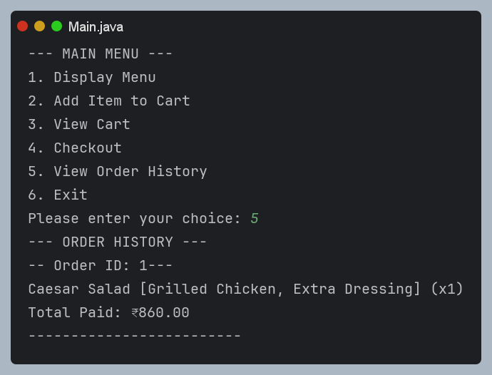

# Food Ordering System

A console-based Food Ordering System built in Java, demonstrating clean object-oriented design through the use of the **Prototype** and **Factory Method** design patterns. Users can browse a menu, customize food items, manage a shopping cart, checkout, and view order history.

---

## Table of Contents

<details>
<summary>Click to expand</summary>

- [Overview](#overview)
- [Features](#features)
- [Project Structure](#project-structure)
- [Design Patterns Used](#design-patterns-used)
- [Class Breakdown](#class-breakdown)
- [Screenshots](#screenshots)
- [Getting Started](#getting-started)
- [How to Use](#how-to-use)
- [Sample Run](#sample-run)
- [Menu Items](#menu-items)
- [Future Improvements](#future-improvements)
- [License](#license)

</details>

---

## Overview

The Food Ordering System simulates a simple restaurant ordering workflow entirely in the terminal. It lets a user:

- View a menu of available food items with base prices
- Select and customize an item (toppings, sizes, extras)
- Add customized items to a shopping cart
- View cart contents and running total
- Checkout and generate an order
- View the full order history

---

## Features

<details>
<summary><strong>Menu Browsing</strong></summary>

Displays all available food items along with their base price and unique ID.
</details>

<details>
<summary><strong>Item Customization</strong></summary>

Each food item supports its own customization options (e.g., extra cheese, extra patty, drink size) that affect the final price.
</details>

<details>
<summary><strong>Shopping Cart</strong></summary>

Add multiple quantities of customized items, view the cart, and see the live total.
</details>

<details>
<summary><strong>Checkout and Order History</strong></summary>

Confirm a checkout to generate an order with a unique order ID, then revisit past orders at any time.
</details>

---

## Project Structure

```
FoodOrderingSystem/
├── Main.java                 # Application entry point
├── FoodOrderingSystem.java   # Core application loop and menu handling
├── FoodItem.java              # Abstract base class for all food items
├── Pizza.java                 # Concrete food item
├── Burger.java                 # Concrete food item
├── Salad.java                  # Concrete food item
├── Soda.java                   # Concrete food item
├── Menu.java                   # Holds prototype food items
├── ShoppingCart.java           # Manages selected items and totals
└── Order.java                  # Represents a completed order
```

---

## Design Patterns Used

<details>
<summary><strong>Prototype Pattern</strong></summary>

The `Menu` class stores one prototype instance of each `FoodItem` subtype. When a user selects an item, `create()` is called on the prototype to produce a fresh, uncustomized copy. This avoids re-instantiating menu logic and keeps the base menu items immutable templates.
</details>

<details>
<summary><strong>Template Method (via Abstract Class)</strong></summary>

`FoodItem` defines shared behavior (`getName()`, `getPrice()`, `equals()`, `hashCode()`) while leaving `customize()` and `create()` abstract, letting each subclass define its own customization flow.
</details>

---

## Class Breakdown

| Class | Responsibility |
|---|---|
| `Main` | Launches the application |
| `FoodOrderingSystem` | Runs the main loop, routes user choices |
| `FoodItem` | Abstract base for all menu items |
| `Pizza`, `Burger`, `Salad`, `Soda` | Concrete menu items with custom options |
| `Menu` | Stores and serves prototype items |
| `ShoppingCart` | Tracks selected items and quantities |
| `Order` | Represents a finalized, paid order |

---

## Getting Started

### Prerequisites

- Java JDK 8 or higher installed
- A terminal or command prompt

### Compilation

```bash
javac *.java
```

### Running the Application

```bash
java Main
```

> **Note:** `Main.java` currently declares `static void main()` without the `String[] args` parameter. Update it to the standard signature below before running, since the JVM requires this exact signature as an entry point:
>
> ```java
> public static void main(String[] args) {
>     FoodOrderingSystem system = new FoodOrderingSystem();
>     system.run();
> }
> ```

---

## How to Use

<details>
<summary><strong>1. Display Menu</strong></summary>

Lists all food items with their ID and base price.
</details>

<details>
<summary><strong>2. Add Item to Cart</strong></summary>

Select an item by ID, walk through its customization prompts, then specify a quantity.
</details>

<details>
<summary><strong>3. View Cart</strong></summary>

Shows every item currently in the cart along with quantities and the running total.
</details>

<details>
<summary><strong>4. Checkout</strong></summary>

Displays the total and asks for confirmation. On confirmation, generates an order and clears the cart.
</details>

<details>
<summary><strong>5. View Order History</strong></summary>

Lists all previously completed orders with their items and totals.
</details>

<details>
<summary><strong>6. Exit</strong></summary>

Closes the application.
</details>

---

## Screenshots

> Replace the image paths below with your own screenshots placed inside a `screenshots/` folder in the project root. GitHub will render them automatically once the files exist at those paths.

<details>
<summary><strong>Main Menu</strong></summary>



</details>

<details>
<summary><strong>Browsing the Food Menu</strong></summary>



</details>

<details>
<summary><strong>Customizing an Item</strong></summary>



</details>

<details>
<summary><strong>Viewing the Cart</strong></summary>



</details>

<details>
<summary><strong>Checkout Confirmation</strong></summary>



</details>

<details>
<summary><strong>Order History</strong></summary>



</details>

---

## Sample Run

```
Welcome to the Food Ordering System!

--- MAIN MENU ---
1. Display Menu
2. Add Item to Cart
3. View Cart
4. Checkout
5. View Order History
6. Exit
Please enter your choice: 2

---Menu(Base Price)---
1 Margherita Pizza - ₹720.00
2 Cheese Burger - ₹250.00
3 Caesar Salad - ₹580.00
4 Soda - ₹120.00
-----------------------
Enter the ID of the item you want to add: 2
Customizing:Cheese Burger:
 Add extra patty? (+₹100) (Yes/ No): yes
 Add extra bacon? (+₹50) (Yes/ No): no
Enter quantity for Cheese Burger [Extra Patty]: 2
2 x Cheese Burger [Extra Patty](s) added to the cart.
```

---

## Menu Items

| ID | Item | Base Price (₹) | Customization Options |
|---|---|---|---|
| 1 | Margherita Pizza | 720.00 | Extra Cheese (+120), Pepperoni (+160) |
| 2 | Cheese Burger | 250.00 | Extra Patty (+100), Extra Bacon (+50) |
| 3 | Caesar Salad | 580.00 | Grilled Chicken (+240), Extra Dressing (+40) |
| 4 | Soda | 120.00 | Small (+0), Medium (+40), Large (+80) |

---

## Future Improvements

- Fix `Main.java` to use the standard `main(String[] args)` signature
- Add input validation for negative or non-numeric quantities
- Add the ability to remove or edit items already in the cart
- Persist order history to a file or database between sessions
- Add unit tests for cart calculations and item customization logic

---

## License

This project is open source and available for personal or educational use.